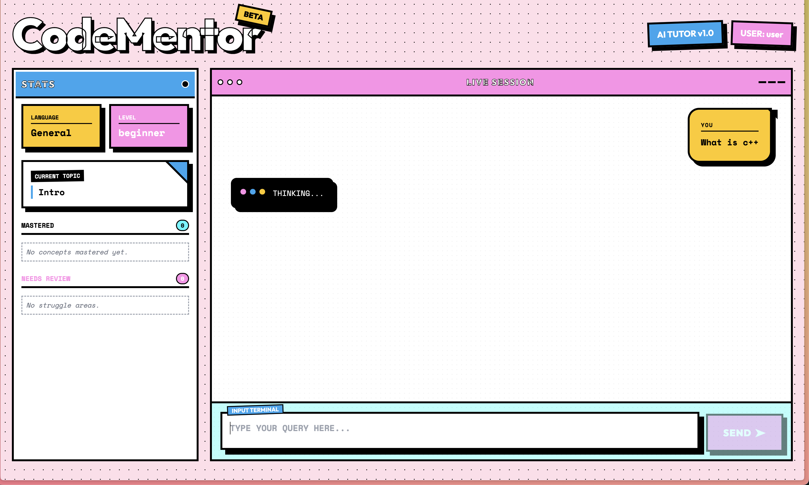

# CF_AI_CodeMentor



**A personalized coding tutor for exam prep, powered by Cloudflare Workers AI, Durable Objects, and Pages.**

## Overview
CF_AI_CodeMentor is an AI-powered application designed to help students prepare for coding exams. It adapts to the user's skill level, tracks learning progress, and generates personalized practice problems.

The frontend features a unique **Neobrutalist "Dorksense" design**, making the learning experience vibrant, tactile, and engaging.

### Key Components
-   **AI**: Uses **Llama 3.3** (`@cf/meta/llama-3.3-70b-instruct-fp8-fast`) via Workers AI for intelligent tutoring.
-   **State**: Uses **Durable Objects** to maintain persistent user learning state (topics, mastery, history).
-   **Frontend**: A React-based chat interface with a custom Neobrutalist design system, deployed on Cloudflare Pages.

## Project Structure
-   `workers/`: Cloudflare Workers backend (API, AI logic, Durable Objects).
-   `frontend/`: React frontend application (Vite + Tailwind CSS).

## Setup & Running

### Prerequisites
-   Node.js installed.
-   Cloudflare account.
-   Wrangler CLI installed (`npm install -g wrangler`).

### Local Development

1.  **Backend (Workers)**
    ```bash
    cd workers
    npm install
    npx wrangler dev
    ```
    The backend will run on `http://localhost:8787`.

2.  **Frontend**
    ```bash
    cd frontend
    npm install
    npm run dev
    ```
    The frontend will run on `http://localhost:5173`.

## Architecture
-   **User** interacts with the **React Frontend**.
-   **Frontend** sends HTTP requests to the **Worker**.
-   **Worker** routes requests:
    -   Interacts with **Durable Object** to retrieve/update User State.
    -   Calls **Workers AI** (Llama 3.3) with context from the Durable Object to generate responses.

## Assignment Compliance
This project fulfills the Cloudflare AI App assignment requirements:
-   **LLM**: Llama 3.3 on Workers AI.
-   **Workflow/Coordination**: Durable Objects for state management.
-   **User Input**: React Chat Interface.
-   **Memory**: Durable Object storage.
-   **Original Work**: Custom implementation and design.

